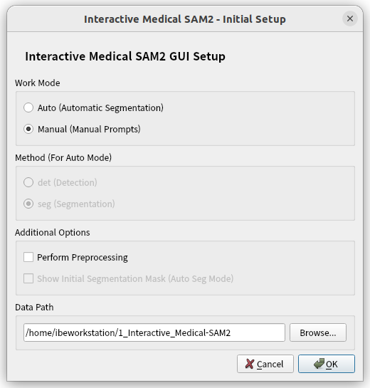
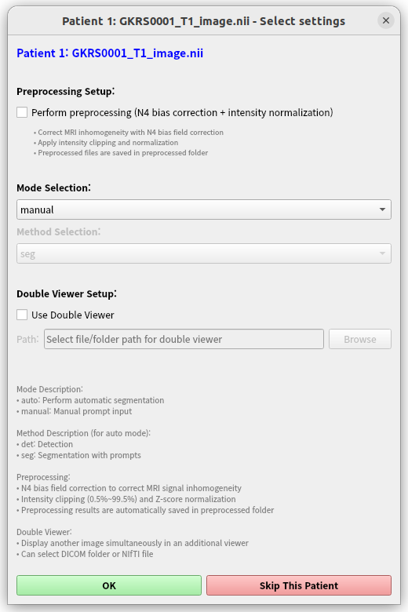
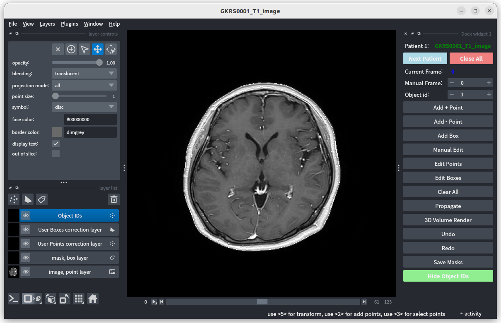

# Interactive Medical SAM2 GUI (SNU_MedSAM2_GUI)

Napari-based GUI that wraps **Medical-SAM2** for **clinical-style, cohort-scale** annotation workflows: load **DICOM** or **NIfTI**, prompt mainly with **boxes** (and optionally points), **propagate** masks across slices, perform **final manual correction**, render **multi-object 3D volumes**, measure **per-object volumes**, and save masks **aligned to the source geometry** (spacing/origin/direction).

This tool is intended for **research annotation workflows** and does not provide clinical decision support.

---

## Typical workflow (recommended)

1) Select a **root folder** containing patient DICOM series folders and/or NIfTI files.  
2) Patients are discovered and processed **sequentially**. For each patient you can proceed or **skip**.  
3) Use **box prompts** (primary) and optional **point prompts** (refinement) to define objects.  
4) Run **propagation** (Medical-SAM2) to obtain masks across the target slice range.  
5) Inspect results. If needed, adjust prompts and propagate again.  
6) When the result is satisfactory, perform **final manual correction** (brush/erase) and then **save**.  
7) On save, the GUI computes **per-object volumetry** and supports **3D volume rendering** for shape inspection.

> Boxes generally provide higher fidelity than points. Draw boxes **tightly** around the object.

Raw MRI can optionally undergo **N4 bias field correction** and **intensity normalization** before prompting.

---

## Features

- **Cohort navigation:** point the GUI to a root folder; cases are handled sequentially with the ability to proceed/skip per patient.
- **Box/point prompting + propagation** with undo/redo history.
- **Single-object first/last propagation:** for a single object, tight boxes on the **first and last** slices are typically sufficient to segment intermediate slices.
- **Multi-object annotation:** annotate multiple objects in one volume with explicit per-object prompts.
- **Manual edit mode:** label painting/erasing and box editing inside Napari; full brush-based mask creation is supported when model outputs need replacement.
- **Quantification & visualization:** multi-object 3D volume rendering and **per-object volume computation**.
- **DICOM/NIfTI loading with geometry preservation:** mask export matches source spacing/origin/direction.
- **Linux/Windows support** with CUDA-enabled or CPU-only PyTorch builds.
- Optional MRI preprocessing: **N4 bias field correction** and intensity normalization.

---

## Installation (conda)

1) Create environment with Qt handled by the solver:

```bash
conda create -y -n medsam -c conda-forge python=3.12 pyqt=5.15.* pyopengl pip
conda activate medsam
```

2) Install PyTorch matching your GPU/driver. The commands below are examples; check your NVIDIA driver’s supported CUDA runtime and pick a matching torch build (or CPU-only):

```bash
# CUDA 12.1
pip install torch torchvision torchaudio --index-url https://download.pytorch.org/whl/cu121
# CUDA 11.8
pip install torch torchvision torchaudio --index-url https://download.pytorch.org/whl/cu118
# CPU-only
pip install torch torchvision torchaudio --index-url https://download.pytorch.org/whl/cpu
```

3) Install project dependencies:

```bash
pip install -r requirements.txt
```

4) Download model weights:

- Grab `Medical_SAM2_pretrain.pth` from Hugging Face:
  https://huggingface.co/jiayuanz3/MedSAM2_pretrain/tree/main

Place it in the project root or update your path in `cfg.py`.

Windows: identical steps in an Anaconda/Miniconda/Miniforge PowerShell prompt after activating the env. Linux users should ensure the installed NVIDIA driver supports the chosen CUDA runtime (`nvidia-smi`).

---

## Quick start

```bash
conda activate medsam
python medsam_gui.py
```

During setup, pick mode and data path. **Manual mode** uses user-supplied prompts (boxes/points) and propagation.  
If an **auto mode** is present in your build, it is intended to accept automatically generated prompts from upstream detection/segmentation models (see Roadmap).

---

## Usage

Navigation dialogs guide you through dataset selection and per-patient options.



- Main dialog:
  - choose `manual` (user-supplied prompts).
  - `auto` is reserved for workflows where initial prompts are produced by an upstream detection/segmentation model.
  - Enable “Perform preprocessing” for raw MRI (N4 + intensity normalization).
  - Set `Data path` to a folder containing NIfTI files or DICOM series.



- Patient queue:
  - patients in the data path are processed in order.
  - for each patient you can toggle preprocessing and mode.
  - `Double viewer` lets you view paired series (e.g., T1/T2) together.



- Workspace:
  - left panel lists layers (image, prompt/mask layers, user points/boxes).
  - right panel holds prompt, propagation, editing, and export controls.

---

## Prompting & propagation (important guidelines)

### Box creation (how to draw a box)

To create a box prompt:
1) click the **top-left** corner  
2) then click the **bottom-right** corner  

For best results, draw the box **as tightly as possible** around the object (minimize empty background).

### Single-object workflow (fast path)

For a single target object in a 3D volume:

1) find the **first slice** where the object appears → draw a tight **box**  
2) find the **last slice** where the object appears → draw a tight **box**  
3) run **Propagate** to automatically segment intermediate slices  

This is the recommended high-throughput workflow for one structure that varies smoothly across slices.

### Multi-object workflow (explicit control)

For multiple objects:

- provide prompts **per slice** and **per object** on the slices where each object needs to be tracked.
- recommended rule for stable behavior:
  - **one box per object per slice** (avoid multiple boxes for the same object on the same slice)
- multiple point prompts (positive/negative) are allowed for refinement.

### Point prompts (secondary / refinement)

Point prompts are used to refine a prediction on a slice (small additions/corrections):

- place **positive / negative** clicks on the visible slice.
- in the current workflow, point prompts are intended to be used **together with** a box prompt for that object on the same slice (box defines the object region; points provide additional guidance).

### Controls (GUI)

- `Add Box`: click top-left then bottom-right to place a box prompt (works on box/mask layers).
- `Add + / - Point`: place positive/negative clicks on the visible slice.
- `Propagate`: run Medical-SAM2 propagation using the prompted slice range.

---

## Editing and QA (final correction)

- Manual edit mode: brush/erase labels, adjust brush size, change object ID colors, and tweak mask opacity.
- `Edit Points`: toggle editability of user point layer to move/delete points.
- `Edit Boxes`: toggle editability of user box layer; rectangles keep shape during edits.
- `Manual Edit`: enable/disable napari painting/rectangle drawing.
- `Clear All`: remove prompts/masks and reset history.
- `Hide/Show Object IDs`: toggle object ID overlays.
- `Undo`/`Redo`: prompt history management.

**Recommended practice:** use prompts + propagation to obtain the best segmentation, then perform **final manual correction** and save. This keeps the workflow consistent and reproducible.

---

## Under the hood (prompt pipeline)

- Prompts are stored as `pos_points`, `neg_points`, and `box_prompts`; `Undo/Redo` replays this history.
- Boxes sync from the “User Boxes correction layer” and are auto-rectified to valid rectangles; edits keep shapes stable.
- Points sync from the “User Points correction layer” and preserve original object IDs when edited.
- Propagation builds a sub-volume between the min/max prompted slices, pushes boxes then points into Medical-SAM2 (`train_add_new_bbox` → `train_add_new_points`), and collects logits via `propagate_in_video` to form per-slice label masks.

---

## 3D visualization and volumetry

- `3D Volume Render`: PyVista view to inspect object location and morphology.
- per-object volumes are computed from:
  - `voxel_volume_mm3 × voxel_count`

This supports tasks such as tumor burden monitoring and rapid sanity-checking of final labels.

---

## Saving outputs

- `Save Mask`: choose an output folder; object-wise masks and a combined mask are saved as `.nii.gz` with preserved geometry (spacing/origin/direction).

---

## Layers (left panel)

- `image, point layer`: base image per slice.
- `mask, box layer`: labels/masks and box drawing surface.
- `User Points correction layer`: editable user points (positive/negative) for prompts.
- `User Boxes correction layer`: editable rectangles for box prompts.
- `Object IDs`: optional overlay for object ID display.

---

## Data and intensity handling

- Accepts DICOM folders or NIfTI files. Geometry (spacing/origin/direction) is preserved on save.
- Per-slice preprocessing for display/model input:
  - percentile clip (0.5/99.5), normalize per slice, scale to 0–255 `uint8`.
  - tensors are cast to `float32` but retain the 0–255 range before entering the model.

---

## Outputs

- Masks are saved with the original geometry.
- Per-object volumetry summaries are available from the GUI, along with 3D renderings and saved with masks.

---

## Tests / Sanity checks

- Import check (headless):
```bash
python - <<'PY'
import dataloader, gui.navigation, gui.segmentation
print("Imports OK")
PY
```

- GPU/driver check:
  - Linux: `nvidia-smi`
  - Windows: `nvidia-smi` in PowerShell
  - then verify CUDA with:
```bash
python - <<'PY'
import torch
print("CUDA available:", torch.cuda.is_available())
print("CUDA device:", torch.cuda.get_device_name(0) if torch.cuda.is_available() else "CPU")
PY
```

- GUI smoke test:
  - `python medsam_gui.py`
  - load a sample DICOM/NIfTI folder and confirm that images, prompt layers, propagation, and saving run without errors.

---

## Roadmap (planned extension)

Planned extension: integrate an upstream **automatic detection and/or segmentation model** to **auto-generate initial prompts**, then keep the same in-GUI workflow:

**auto prompts → review → adjust prompts → propagate → final correction → save**.

---

## How to cite

Until a JOSS DOI is issued, please cite the repository:
https://github.com/SKKU-IBE/SNU_MedSAM2_GUI

The Medical-SAM2 model and weights are from:
- https://github.com/ImprintLab/Medical-SAM2
- https://huggingface.co/jiayuanz3/MedSAM2_pretrain

Please cite their work per their license.

---

## License

GPL-3.0-only (see `LICENSE`).

Model weights: download from the Hugging Face link above (or the upstream repository) and follow their respective licenses.
